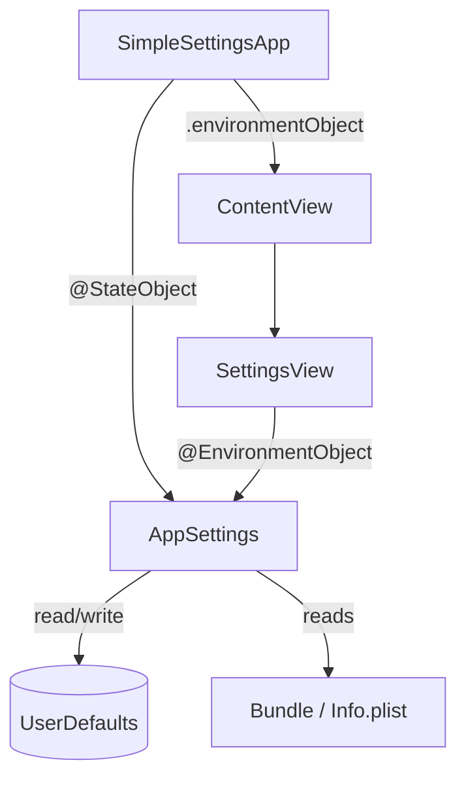
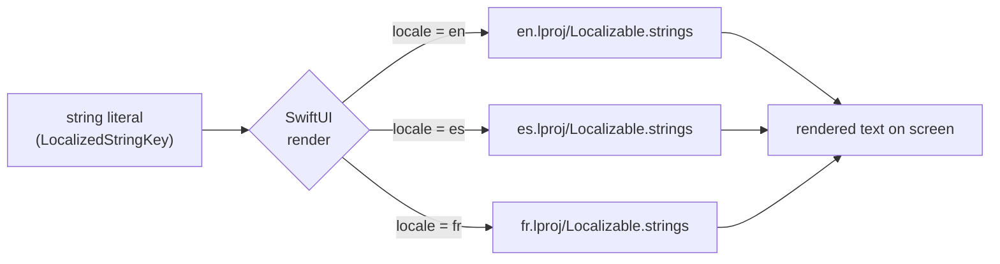
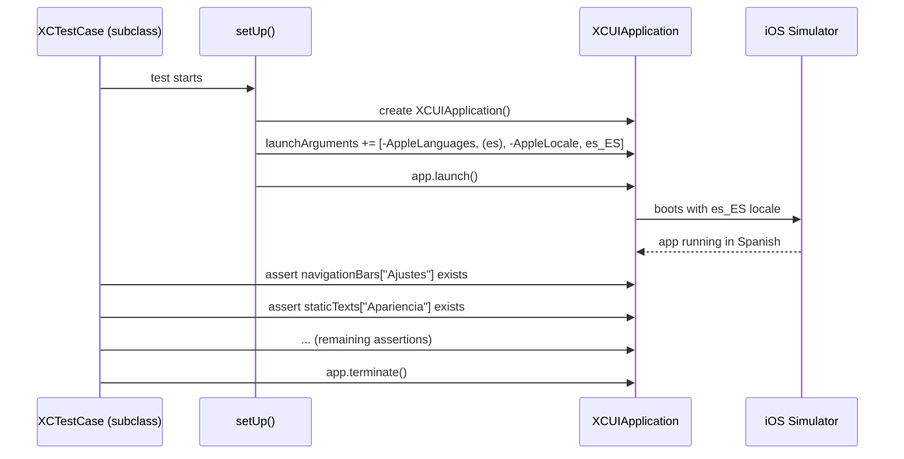
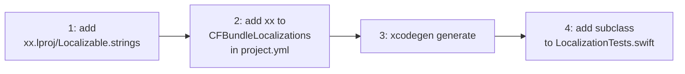

# xcui-l10n

A minimal SwiftUI settings screen built for XCUITest localization testing. The app itself is intentionally small with only three sections, a couple of toggles, a picker. This is so the tests stay focused on the one thing we care about: verifying that every string on screen renders in the right language.

The app has support for English, Spanish and French built in, but i have kept the steps to add a new locale below.

---

## How the app is structured



`AppSettings` is the only model object. It owns three user preferences and reads the version/build strings from `Info.plist` at init time. `SettingsView` is a pure consumer, it never writes to `UserDefaults` directly, everything goes through the model.

---

## How the localization works

Every string in the UI is a `LocalizedStringKey`. SwiftUI resolves these at render time against the active locale bundle, so no `NSLocalizedString` boilerplate needed.



---

## How the tests work

Each locale gets its own `XCTestCase` subclass. Before launch, `setUp` injects `-AppleLanguages` and `-AppleLocale` as launch arguments, which forces the simulator into that locale without touching any device setting.



The tests find elements by their **translated label**, not by accessibility identifier. That's deliberate, as hardcoded English string in the Spanish build fails the test immediately.

---

## Getting started

**Requirements:** Xcode 16+, [xcodegen](https://github.com/yonaskolb/XcodeGen)

```bash
brew install xcodegen
xcodegen generate
open SimpleSettings.xcodeproj
```

Run the tests from Xcode with `Cmd+U`, or from the terminal:

```bash
xcodebuild test \
  -project SimpleSettings.xcodeproj \
  -scheme SimpleSettings \
  -destination "platform=iOS Simulator,name=iPhone 16" \
  CODE_SIGNING_ALLOWED=NO
```

---

## Adding a new locale



**Step 4** is a small subclass, override `locale` and `region`, then write the expected translated strings:

```swift
class SettingsLocalizationGermanTests: LocalizationTestCase {
    override var locale: String { "de" }
    override var region: String { "DE" }

    func testNavigationTitle() { waitFor(app.navigationBars["Einstellungen"]) }
    func testSectionHeaders() {
        waitFor(app.staticTexts["Erscheinungsbild"])
        waitFor(app.staticTexts["Mitteilungen"])
        waitFor(app.staticTexts["Über"])
    }
    // ...
}
```
